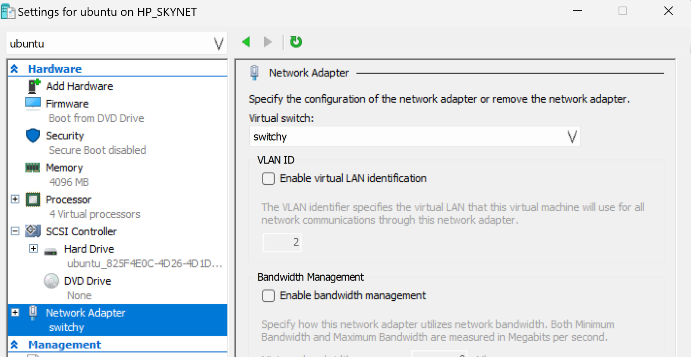

# Homework #1: Setup VMs

## Peter Wells, 10/09/2023

### Note

Unfortunately I had already set up the two VMs prior to seeing the homework assignment telling me to document the process. I followed the [VM Setup for Windows](https://dkmcgrath.github.io/sysadmin/hyper-v.html) instructions found on the course webpage. I did not run into any major issues and found the instructions worked as intended. I am setting this up on a Windows 11 machine in Hyper-V.

### After the fact note (2024)

The VM's were setup with a custom network switch (seen below) in such a way that FreeBSD was connected to the internet through my pc and Ubuntu was attached to the internal network via the custom switch. This way Ubuntu had no direct access to the internet and needed to be routed through FreeBSD's router / firewall. The VMs had "generation 2" selected and have secure boot disabled as this caused issues during install. The images used were [FreeBSD-13.2-RELEASE-amd64-dvd1.iso](https://download.freebsd.org/releases/amd64/amd64/ISO-IMAGES/13.2/) and [Ubuntu Server 22.04.3](https://ubuntu.com/download/server).

### Hyper-V Network Setup

Here is how the network switches are set up between the VMs. FreeBSD has access to both the default switch and the private "switchy" switch while Ubuntu only has access to the "switchy" one. It is able to access the internet through FreeBSD.

**Hyper-V Switch Setup**


**FreeBSD VM Network Configuration**


**Ubuntu VM Network Configuration**


### FreeBSD `ifconfig` output


### Ubuntu `ip a s` output


### Ubuntu Configuration Documentation

When setting up the network switches it appears that the Ubuntu system 'automagically' had the correct settings to access the internet so I called it good for the first section of the [ubuntu instructions](https://dkmcgrath.github.io/sysadmin/ubuntu.html).

I did run into a few hiccups when trying to get the ssh tunnel working, however.

**Hiccup #1** The`~/.ssh/config` file does not exist on my host machine! (Windows 11)

**Solution Part A** Install OpenSSH Server via command line. (Probably unnecessary but my system was missing it so I installed this)
`Add-WindowsCapability -Online -Name OpenSSH.Server~~~~0.0.1.0`

**Solution Part B** Simply manually create the `~/.ssh/config` file. This allowed me to reach the next hiccup.

**Hiccup #2** Correct password was rejected by the FreeBSD VM. Attempting to log in resulted in a PAM authentication error.

**Solution** Edit both `/etc/ssh/ssh_config` and `/etc/ssh/ssh_config` inside the FreeBSD VM. Uncomment and set both `PasswordAuthentication` and `PermitRootLogin` to yes. [Solution Found Here](https://superuser.com/questions/1663807/pam-authentication-error-when-trying-to-log-in-via-ssh-to-freebsd-on-virtualbox)

**Hiccup #3** When resetting the VM, the IP address changes on FreeBSD which breaks the SSH tunnel.

**Solution** Setting a static IP inside the FreeBSD VM will solve this but I have not gotten around to it yet, therefore... **Temp solution!** Update the FreeBSD Hostname in `~/etc/.ssh/config` whenever resetting the VM.

Once past these problems, the rest of the Ubuntu set up went smoothly. I updated/upgraded `apt`, expanded the filesystem with `sudo lvextend --extents +100%FREE /dev/ubuntu-vg/ubuntu-lv --resizefs`, and installed the useful tools mentioned at the end.  

### ~/.ssh/config contents

```
Host bsd
    Hostname 172.23.141.55
    IdentityFile ~/.ssh/hostkey
    User root

Host ubuntu-vm
    Hostname 192.168.33.127
    IdentityFile ~/.ssh/hostkey
    User pwell2
    ProxyJump bsd
```

**Note** As mentioned before it appears that my FreeBSD machine is changing it's IP everytime I restart the VM but the Ubuntu machine seems to still work just fine through the proxy jump. For now I've just been updating `~/.ssh/config` with the new ip whenever resetting FreeBSD but plan on setting a more permanent solution like a static ip soon. Hence why the bsd host's IP does not match the screenshot.
