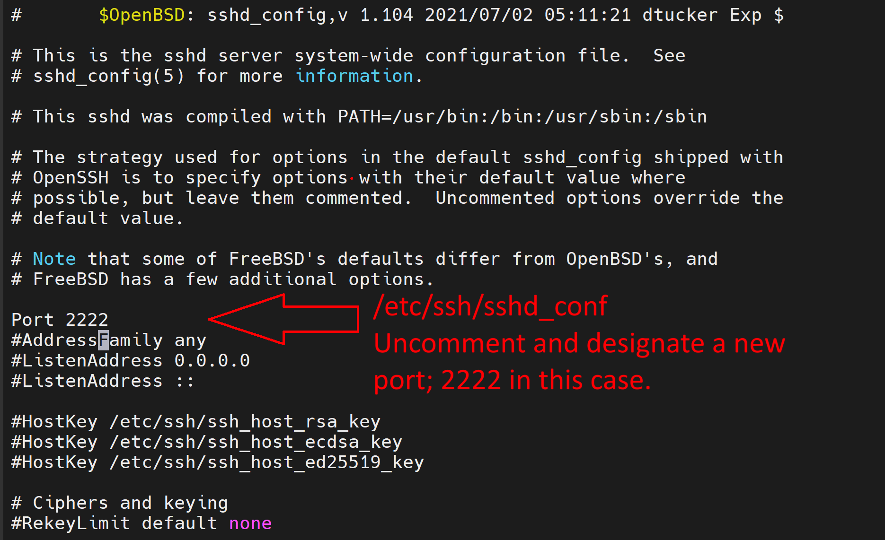

# Homework #2: Firewall ssh Modification and Snort Install

## Peter Wells, 10/23/2023

### 1. Create a firewall rule to forward ssh traffic from bastion host port 22 to Ubuntu port 22 in `/etc/pf.conf`

NOTE: Make sure you have a way to connect to the machine before doing this! If you finish this step without either: modifying the ssh server to run on another port (see next section) or setting up a serial interface you will lose access.

To create the redirect firewall rule you must add a new rule between the #NAT and #Blocking rules in pf.conf. First I defined a variable `$ubuntu_ip` at the top of the file and then wrote this rule: `rdr pass on $ext_if proto tcp to port 22 -> $ubuntu_ip port 22` which will take tcp traffic on port 22 and pass it to the ubuntu vm.


You will also need to add a pass rule to allow traffic back out through the BSD machine. For me this was: `pass out on $int_if proto tcp to $ubuntu_ip port 22 flags S/SA`


Once these rules are added, load the changes into pf with `pfctl -f /etc/pf.conf`

### 2. Modify the local ssh server and move it to a different port for management purposes

#### Step 1: Change local ssh server port to a different port in `/etc/ssh/sshd_config`

Find the line with the default port (Port 22) and uncomment it and add a new port to use.



#### Step 2: Adding a firewall rule to allow ssh connections on this new port in `/etc/pf.conf`

Changing this port will cause any ssh connection to fail even if you specify the port while connecting. This is because the pf firewall is blocking the packets; so a pass rule needs to be added to `/etc/pf.conf`. I went with: `pass in on $ext_if proto tcp to port 2222 flags S/SA` to allow connections on port 2222 over tcp.


After adding the rule, I reloaded them into pf with the command `pfctl -f /etc/pf.conf` and relaunched the sshd server with `service sshd restart`. After that it's possible to ssh into the FreeBSD machine again so long as you specify the new port (2222) when doing so.

Troubleshooting: use command `tcpdump -n -e -i pflog0` to see what packets are being blocked if something is going wrong.

### 3. Install Snort on the Bastion host. Have it load at boot time so that it’s actively protecting your network

#### Installation / Configuration

I used pkg to install snort: `pkg install snort`.

To set snort to start on booting the BSD use the following command to add snort_enable to the `/etc/rc.conf` file: `sysrc snort_enable="YES"`

Next there was a lot of detailing that had to be done in `/usr/local/etc/snort/snort.conf`. I was able to determine what needed to change in the file by restarting the FreeBSD machine repeatedly and monitoring the output each time as it loaded. Running the command `snort` didn't seem to show these problems. Here is the list of changes I needed to make to get Snort to run on boot

1. Set the `$HOME_NET` variable to `192.168.33.0/24`
2. Set an absolute path for the variable `RULE_PATH` (`/usr/local/etc/snort/rules/` in this case) 
3. Comment out `whitelist $WHITE_LIST_PATH/white_list.rules, \` and `blacklist $BLACK_LIST_PATH/black_list.rules` in Step #5 
4. Uncomment all of the output plugins in Step #6 
5. Comment out all of the various `$RULE_PATH` includes in Step #7 
6. Download the [snort community.rules file](https://www.snort.org/downloads/#rule-downloads), extract them to `.../snort/rules` with `tar -zxvf`, and add the include in `snort.conf`
7. Create custom SMBGhost rules and add them to `.../snort/rules` and add the include in `snort.conf` 

After all of that, when rebooting the FreeBSD machine, Snort would launch and start running in the background. (can you tell I'm a little *salty*? :))


I want to make a suggestion to use Suricata next time as it seemed much easier to set up and configure in Network Security than Snort has been here.

### 4. Ensure snort can protect against [SMBGhost Attacks](https://github.com/jamf/CVE-2020-0796-RCE-POC)

First, I read about the SMBGhost attack as detailed in [this McAffee analysis article.](https://www.mcafee.com/blogs/other-blogs/mcafee-labs/smbghost-analysis-of-cve-2020-0796/)

It looks like the attack is caused by not checking the signed-ness of two fields in two fields of the SMB2 Compression Header allowing the attacker to allocate a smaller buffer than expected. When it decompresses, the buffer extend go well beyond its intended value as it expects an unsigned long (which means a negative number could be cast into a much larger positive one); resulting in remote code execution on the targeted machine.

To combat this first create a custom rules file in `.../snort/rules` called `smb-ghost.rules` and add rules to detect the problem.

For the SMBGhost rules, I decided to look up some online and explain how they work. I found my rules [on  Claroty's github page here](https://github.com/claroty/CVE2020-0796/blob/master/snort_rules/smbv3_compressed_data.rules). I have added linebreaks here for easier reading. Explanation below

```
###############
# These rules will detect SMB compressed communication by the SMB protocol identifier. 
# The use of the offset and depth parameter is designed to prevent false positives and to allow the NetBios Layer
###############
alert tcp any any -> any 445 
(
msg:"Claroty Signature: SMBv3 Used with compression - Client to server"; 
    content:"|fc 53 4d 42|"; offset: 0; depth: 10; 
sid:1000001; rev:1; reference:url,blog.claroty.com/advisory-new-wormable-vulnerability-in-microsoft-smbv3;
)

alert tcp any 445 -> any any 
(
msg:"Claroty Signature: SMBv3 Used with compression - Server to client"; 
    content:"|fc 53 4d 42|"; offset: 0; depth: 10; 
sid:1000002; rev:1; reference:url,blog.claroty.com/advisory-new-wormable-vulnerability-in-microsoft-smbv3;
)

#############
# These rules detect server/client with compression enabled based on the negotiation packet
#############
alert tcp any any -> any 445 
(
msg:"Claroty Signature: SMBv3 Negotiate Protocol Request with Compression Capabilities Context"; 
    content:"|fe 53 4d 42|"; offset: 4; depth: 10; 
    content:"|00 00 00 00|"; distance: 6;  
    content:"|11 03|"; distance: 86; within: 20; 
    content:"|03 00|"; distance: 2;  
    content:"|00 00 00 00 00 |"; distance: 1; within: 5; 
    content:"|00 00 00 00 00 |"; distance: 1; within: 5; 
sid:1000021; rev:1; reference:url,blog.claroty.com/advisory-new-wormable-vulnerability-in-microsoft-smbv3;
)

alert tcp any 445 -> any any 
(
msg:"Claroty Signature: SMBv3 Negotiate Protocol Reponse with Compression Capabilities Context"; 
    content:"|fe 53 4d 42|"; offset: 4; depth: 10; 
    content:"|00 00 00 00 00 00|"; distance: 4;  
    content:"|11 03|"; distance: 50; within: 8; 
    content:"|03 00 |"; distance: 64; within:400;  
    content:"|00 00 00 00 00 |"; distance: 1; 
    content:"|00 00 00 00 00 |"; distance: 1; 
sid:1000022; rev:1; reference:url,blog.claroty.com/advisory-new-wormable-vulnerability-in-microsoft-smbv3;
)
```

The first two rules essentially look for packets with the SMB protocol identifier (`fc 53 4d 42`) on port 445 and block those. It uses the offset and depth parameters to confirm it is the SMB compressed communication and prevent false positives for both client and server side traffic.

The next two rules look at SMB negotiation packets (this time with signature `fe 53 4d 42`) and runs a series of checks to see if they are being used for the SMBGhost attack. Next we'll need to look at the [packet diagram for the smb2 header](https://learn.microsoft.com/en-us/openspecs/windows_protocols/ms-smb2/fb188936-5050-48d3-b350-dc43059638a4) as well as the [packet diagram for the smb2 negotiation Request packet](https://learn.microsoft.com/en-us/openspecs/windows_protocols/ms-smb2/e14db7ff-763a-4263-8b10-0c3944f52fc5) and [packet diagram for the smb2 negotiation reponse packet](https://learn.microsoft.com/en-us/openspecs/windows_protocols/ms-smb2/63abf97c-0d09-47e2-88d6-6bfa552949a5) to get a better sense of how the rules are detecting the vulnerability.

I will explain these rules using a breakdown line by line for the Protocol Request packet

1. `content:"|fe 53 4d 42|"; offset: 4; depth: 10;`

   `ProtocolId` - this matches to see that we are looking at a Protocol Request Packet, depth 10 is to allow for a netbios layer to prevent false positives.

2. `content:"|00 00 00 00|"; distance: 6;`

    This rule is checking that `CreditCharge` equals 0. This is interesting because on SMB2 this field **must** be 0, but for SMB3 it should show the number of credits charged. This is probably a way of pretending to be an SMBv2 packet when really it's SMB3.

3. `content:"|11 03|"; distance: 86; within: 20;`

    This part of the rule is checking the packet's `Dialects` array field for `0x0311` which determines that the packet uses the SMB 3.1.1 dialect

4. `content:"|03 00|"; distance: 2;`

    Next we check the `Dialects` array to see if `0x0300` (the SMB 3.0 revision number) is present

5. `content:"|00 00 00 00 00 |"; distance: 1; within: 5;`
6. `content:"|00 00 00 00 00 |"; distance: 1; within: 5;`

    These two rules check to see that the rest of the dialect array is empty.

So what this rule does is check for SMBv3 Negotiate Protocol Request packets on port 445 that are pretending to be SMB2 (CreditCharge == 0) and contains the SMB3 dialects.

The Protocol Response Packet detection rule is very similar to the previous rule. Except they have to use different offsets to check the fields of the packet. It appears they generally are just targeting specifically SMB 3.1.1 and SMB 3.0 revision request / response packets and dropping them if the `CreditCharge` field is set to 0.

#### Testing

For testing the Snort rules I took advantage of the fact that there are PCAPs available at the [Claroty git repo where I found the rules](https://github.com/claroty/CVE2020-0796/tree/master). I downloaded them to the FreeBSD machine and ran them through snort with `snort -r <name of the pcap> -c <name of rules set> -i hn0`. For some reason, uncommenting the `config logdir: /var/log/snort/logs` line in `.../snort.conf` to allow logging and loading the rules directly with -c seemed to be necessary for this to work properly.


### Notes on the script writing and general challenges

I found it was *extraordinarily* hard to convince the `sed` command to do what I want and that all advice pertaining to it was incorrect in some way for BSD's version of the command. Even for simple things like appending a line after a match required trying crazy things like using `tr` to translate a character into a `\n` beacuse `sed` didn't support it. This is due to GNU vs POSIX styles of `sed`. I'm sure with more experience with the command I can come up with better solutions but for now I am happy enough with the simple substitutions I am making.

Additionally, the snort configuration seemed rather convoluted and complex when compared to things like suricata. The documentation on it is all over the place and advice is hard to come by as the changes between snort 2 and snort 3 are immense.
