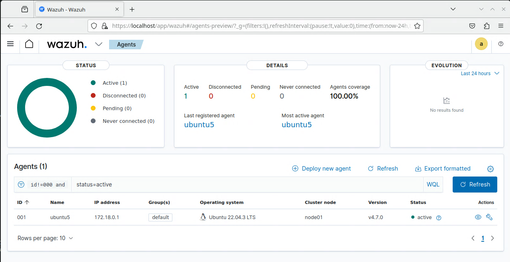

# Homework 4

Peter Wells, 12/1/2023

## Setting up Wireguard / Wireguard UI

### Setup Wireguard on the Ubuntu machine

Repos Referenced / Used:

1. [Wireguard](https://github.com/linuxserver/docker-wireguard)
2. [Wireguard UI](https://github.com/ngoduykhanh/wireguard-ui/blob/master/examples/docker-compose/linuxserver.yml)

Setting up Wireguard with Wireguard UI

1. download the `docker-compose.yml` file located in this folder (`/hw4/docker-compose.yml`) to the ubuntu machine
2. edit the `docker-compose.yml` to set the ip addresses correctly (marked in a comment by each) and also change passwords and usernames
3. run it with `sudo docker-compose up -d --force-recreate --remove-orphans`
4. You can now access the wireguard-ui at `127.1.2.4:5000` in a browser


### Setup FreeBSD firewall rules to allow Wireguard through

In order for wireguard traffic to travel through the FreeBSD router you need to set up some rules in `/etc/pf.conf`

1. Redirects (add above the block rules)
   - `rdr pass on $ext_if proto udp to port 51820 -> $ubuntu_ip port 51820`
   - `rdr pass on $ext_if proto udp to port 5000 -> $ubuntu_ip port 5000`

2. Pass rules (add at the end of the block rules)
   - `pass out on $int_if proto udp to port 51820`
   - `pass out on $int_if proto udp to port 5000`

Once these are in place apply the rules with `pfctl -f /etc/pf.conf`

### Setup a client and connect to the VPN

With the settings configured from the `docker-compose.yml` file, it should now be possible to add a client and connect to the vpn

1. Log into Wireguard UI at `127.1.2.4:5000`. The password and username are both `admin`
2. Select the create new client button to create a client. Give it a descriptive name.
3. If you are using a mobile device you can click the `QR code` button to display a QR code. You scan this from the official Wireguard app taht can be found on your app store. This should enable a connection between your mobile device and the vpn.
4. If not, then click the download button which creates a `.conf` file.
5. Put this file on the machine you wish to connect from and download [the appropriate wireguard client for your machine](https://www.wireguard.com/install/)
6. Then simply import the file into the client and it should work. On the windows ui click Add Tunnel and use the `.conf` file generated from wireguard ui
7. Note that you may need to edit the tunnel and deselect `Block untunneled traffic (kill-switch)` for it to connect


## Wazuh

### Setting up the containerized Wazuh Manager

For Wazuh - I found directions [at this page and followed single-node deployment](https://documentation.wazuh.com/current/deployment-options/docker/wazuh-container.html)

1. Clone the repository down. `git clone https://github.com/wazuh/wazuh-docker.git -b v4.7.0`
2. navigate to the `/single-node` directory.
3. Generate the desired certificates by running `sudo docker-compose -f generate-indexer-certs.yml run --rm generator`
4. Start the Wazuh container with `sudo docker-compose up -d --force-recreate`
5. To open the dashboard, go to `https://localhost`. The default username and password are `admin` and `SecretPassword`
  


### Setting up the Wazuh Agent on Ubuntu

Notice we need to setup the agents still. We need to deploy this on the Ubuntu VM. For that we can [follow this guide](https://documentation.wazuh.com/current/installation-guide/wazuh-agent/wazuh-agent-package-linux.html)

1. Add the Wazuh repository
   1. Switch to the root user `su root` (if you need to set a password use `sudo passwd`)
   2. Install the GPG key: `curl -s https://packages.wazuh.com/key/GPG-KEY-WAZUH | gpg --no-default-keyring --keyring gnupg-ring:/usr/share/keyrings/wazuh.gpg --import && chmod 644 /usr/share/keyrings/wazuh.gpg`
   3. Add the repository: `echo "deb [signed-by=/usr/share/keyrings/wazuh.gpg] https://packages.wazuh.com/4.x/apt/ stable main" | tee -a /etc/apt/sources.list.d/wazuh.list`
   4. Update the package information: `apt-get update`
2. Deploy a Wazuh agent
   1. Get the ip address of the container running Wazuh Manager with `docker inspect <container name>`
   2. `WAZUH_MANAGER="172.18.0.3" apt-get install wazuh-agent` replace 172.18.0.3 with the ip address of the container running manager program
   3. enable and start the Wazuh service
      - `systemctl daemon-reload`
      - `systemctl enable wazuh-agent`
      - `systemctl start wazuh-agent`
3. Disable Wazuh updates to ensure compatibility
   1. `sed -i "s/^deb/#deb/" /etc/apt/sources.list.d/wazuh.list`
   2. `apt-get update`

Troubleshooting: If you accidentally set the wrong IP address for the Docker container what is running the Wazuh Manager, you need to fix it in `/var/ossec/etc/ossec.conf` and then restart the service with `systemctl restart wazuh-agent`



Note: I heard through the grapevine that setting up the Wazuh agent on FreeBSD would be good but overall, optional. I plan on doing this still but have not actually done it yet. I suspect it will be a similar process to setting up the agent on Ubuntu except that you set the ubuntu ip for the WAZUH_MANAGER address. 

### Changing the password for Wazuh Manager

Changing the password is unfortunately rather involved. You will need [to do the following](https://documentation.wazuh.com/current/deployment-options/docker/wazuh-container.html#change-the-password-of-wazuh-users)

1. Setup a new hash
   - `sudo docker-compose down`
   - `sudo docker run --rm -ti wazuh/wazuh-indexer:4.7.0 bash /usr/share/wazuh-indexer/plugins/opensearch-security/tools/hash.sh`
   - Copy the generated hash
   - Open `config/wazuh_indexer/internal_users.yml` and find the block of the user who's password you are changing
   - Replace the hash with the new one
2. Set a new password
   - Open the `docker-compose.yml`
   - Change all occurances of the old password with the new one
   - Apply the changes with `sudo docker compose up -d`
   - Run `sudo docker ps` and note the name of the docker container running the indexer. For example:`single-node-wazuh.indexer-1`
   - Run `sudo docker exec -it <WAZUH_INDEXER_CONTAINER_NAME> bash`
   - Set the following environment variables

```
export INSTALLATION_DIR=/usr/share/wazuh-indexer
CACERT=$INSTALLATION_DIR/certs/root-ca.pem
KEY=$INSTALLATION_DIR/certs/admin-key.pem
CERT=$INSTALLATION_DIR/certs/admin.pem
export JAVA_HOME=/usr/share/wazuh-indexer/jdk
```

  - Next, wait for the indexer to initialize properly. Somewhere between 2-5 minutes. Then run `securityadmin.sh` to apply all the changes (see below).
  - `bash /usr/share/wazuh-indexer/plugins/opensearch-security/tools/securityadmin.sh -cd /usr/share/wazuh-indexer/opensearch-security/ -nhnv -cacert  $CACERT -cert $CERT -key $KEY -p 9200 -icl`
  - Finally you can exit the Wazuh container and log in with the new credentials

To be honest, I did not do this. But wanted to leave the information here for future reference

## Some generally useful commands I used for this homework

Stopping and removing all docker containers

```
   sudo docker stop $(sudo docker ps -a -q)
   sudo docker rm $(sudo docker ps -a -q)
   sudo docker network prune
   sudo docker-compose up -d --force-recreate --remove-orphans
   docker system prune -a
```

running commands on docker containers

```
docker exec -it wireguard wg
docker exec -it wireguard ls
docker exec -it pihole /bin/bash
```

Reloading the pf firewall rules: `pfctl -f /etc/pf.conf`

Checking the traffic being blocked by freeBSD: `tcpdump -n -e -i pflog0`

Setting up the password for root: `sudo passwd`
